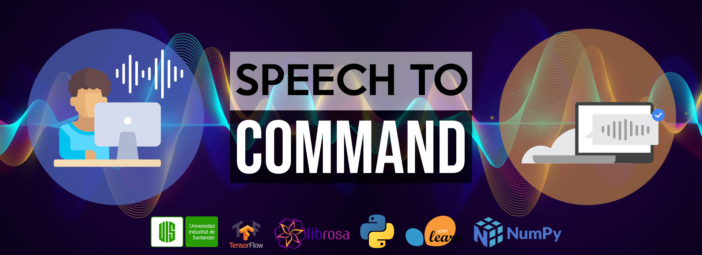

# Speech to command

**Autores: Eduard Caballero, Camila Aparicio, Iván Castillo**

**Objetivo: Reconocer comandos de voz simples en inglés mediante una interfaz que registra la voz y ejecuta acciones de acuerdo a comandos detectados en audios grabados, facilitando la interacción y accesibilidad con dispositivos inteligentes.**  

- Dataset: Cerca de 65k audios (formato WAV) de comandos grabados en inglés por diferentes tonos de voz, cada uno con duración de un segundo, dividido en 30 clases o tipos de comandos.
- Algoritmos utilizados: Arquitectura - DNN, RNN, LSTM y GRU.

[(code)](proyecto/notebook_speech_to_command_IA2.ipynb) [(code colab)](https://colab.research.google.com/drive/1yxOtaj6W-wcMct1Lae_9Oli653EbmkS6) [(video)](https://www.youtube.com/watch?v=eDRIdYVA9E4) [(poster)](proyecto/poster_speech_to_command_IA2.pdf) [(+info)](proyecto/slides_speech_to_command_IA2.pdf)
